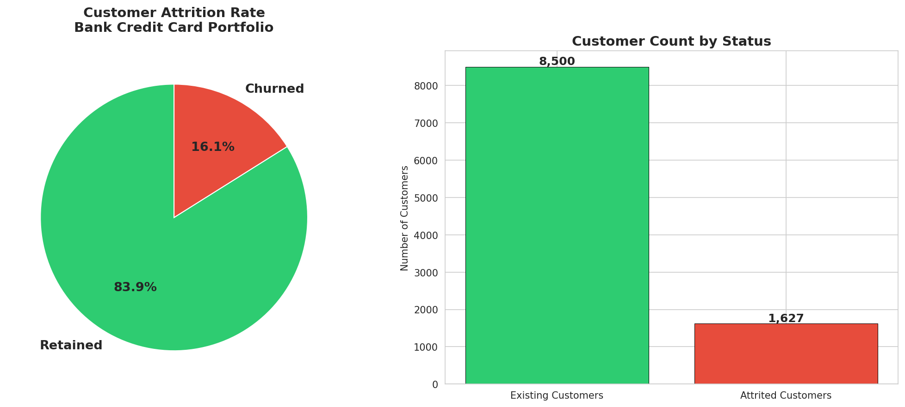
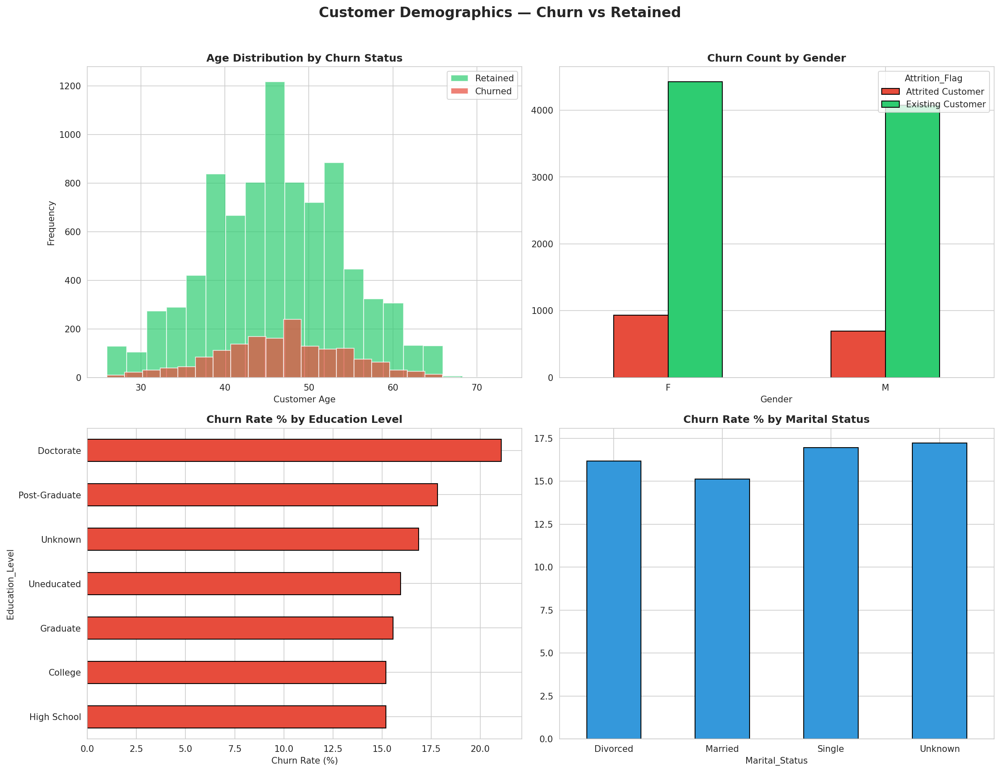
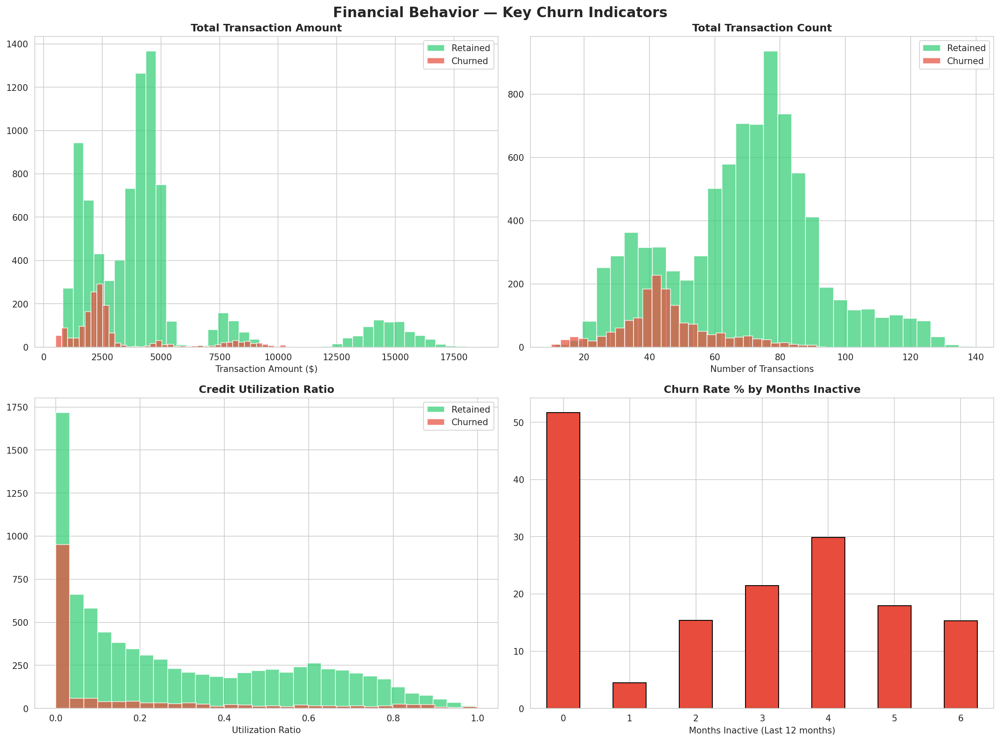
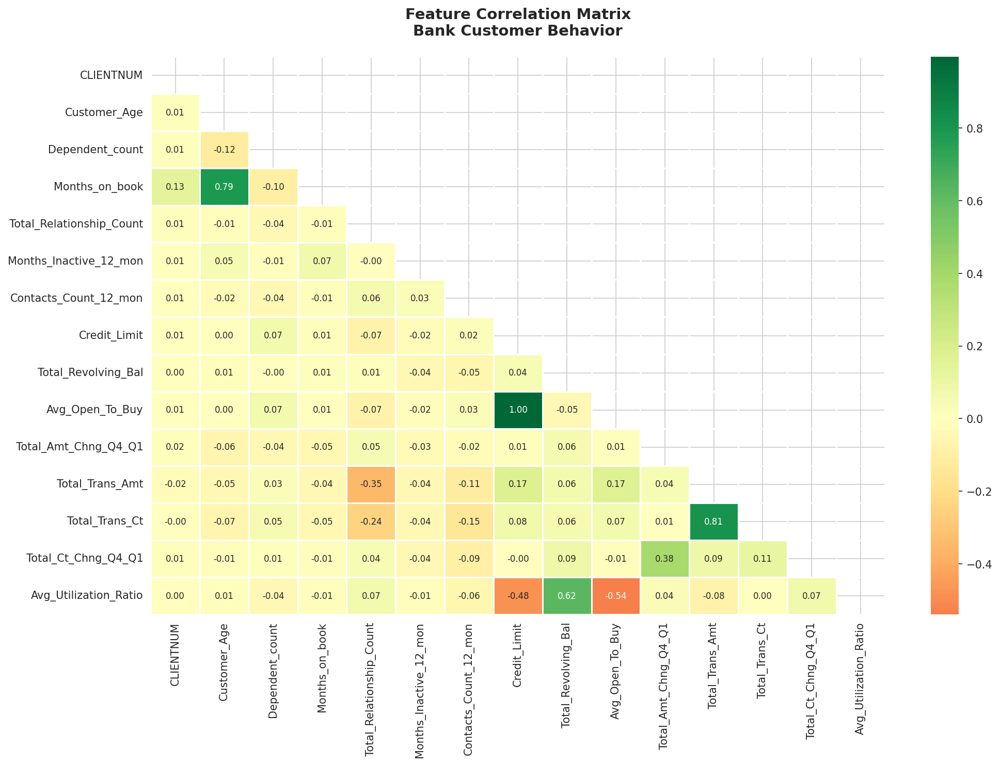
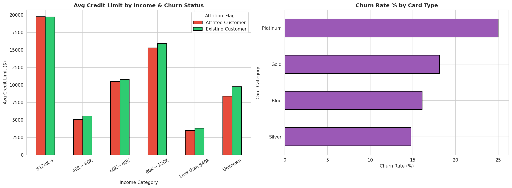

# 💳 Bank Credit Card Customer Churn Analysis


## 📌 Overview
End-to-end **Exploratory Data Analysis** on a bank credit card customer 
dataset to identify churn drivers and deliver actionable retention 
recommendations — simulating real-world financial consulting analysis.

## 🎯 Business Problem
A retail bank is losing credit card customers at a **16% annual rate.**
This analysis answers three critical business questions:
- **Who** is churning?
- **Why** are they churning?
- **What** should the business do about it?

## 🔍 Key Findings
| Finding | Business Impact |
|---------|----------------|
| 16% overall churn rate | ~$484,500 in replacement costs |
| <40 transactions = churn signal | Strongest early warning indicator |
| 3+ months inactivity = churn signal | Trigger point for retention outreach |
| Low credit utilization = disengagement | Card not delivering value |
| Female & single customers churn more | Segment-specific campaigns needed |

## 📊 Analysis Sections
1. 🧹 Data Quality & Overview
2. 📉 Churn Rate & Revenue Impact Calculation
3. 👥 Demographic Analysis (Age, Gender, Education, Marital Status)
4. 💳 Financial Behavior Patterns (Transactions, Utilization, Inactivity)
5. 🔥 Correlation Analysis
6. 🎯 Executive Recommendations

## 🛠️ Tech Stack
| Tool | Purpose |
|------|---------|
| Python 3.9+ | Core analysis |
| Pandas | Data manipulation |
| Matplotlib | Visualizations |
| Seaborn | Statistical plots |
| Google Colab | Cloud notebook environment |

## 📁 Dataset
[Credit Card Customers — Kaggle](https://www.kaggle.com/datasets/sakshigoyal7/credit-card-customers)
- 10,127 customers
- 21 features
- No missing values

## 🚀 Run This Notebook
**Option 1 — Google Colab (Recommended):**

[](https://colab.research.google.com/drive/1ah7oRx_8w0b9NT7hQBe_h_eQ41FF4vUV?usp=sharing)


## 📸 Analysis Preview

### Churn Overview


### Demographics


### Financial Behavior


### Correlation Heatmap


### Credit & Card Analysis


## 💼 Business Recommendations
1. **🚨 Early Warning System** — Flag customers with <40 transactions + 3+ inactive months
2. **💳 Re-engagement Campaign** — Target customers with utilization ratio <10%
3. **🎯 Segment Retention** — Gender & lifestyle-specific loyalty rewards
4. **📊 Next Step** — Build predictive ML model (Random Forest/XGBoost) for 90%+ accuracy

## 👩‍💼 Author
**Shrushti Wakchaure** — Data Analyst

[](https://linkedin.com/in/shrushti-wakchaure)
[](https://github.com/Shrushti72)
[](https://my-portfolio-ochre-kappa-75.vercel.app/)
```


